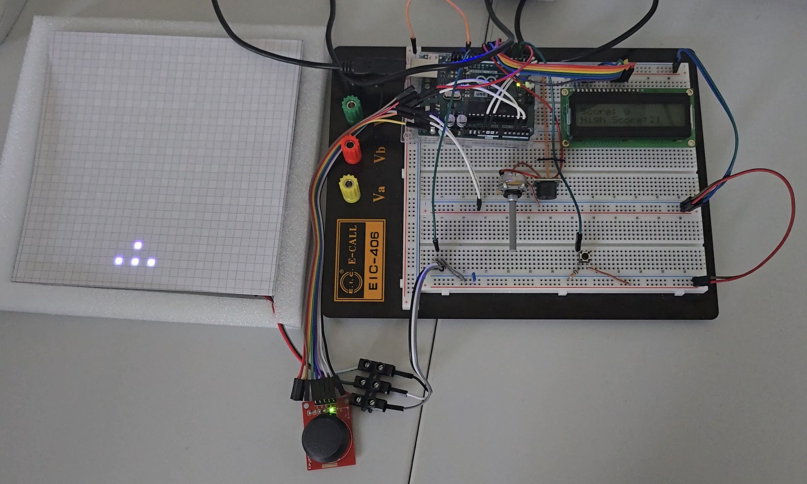
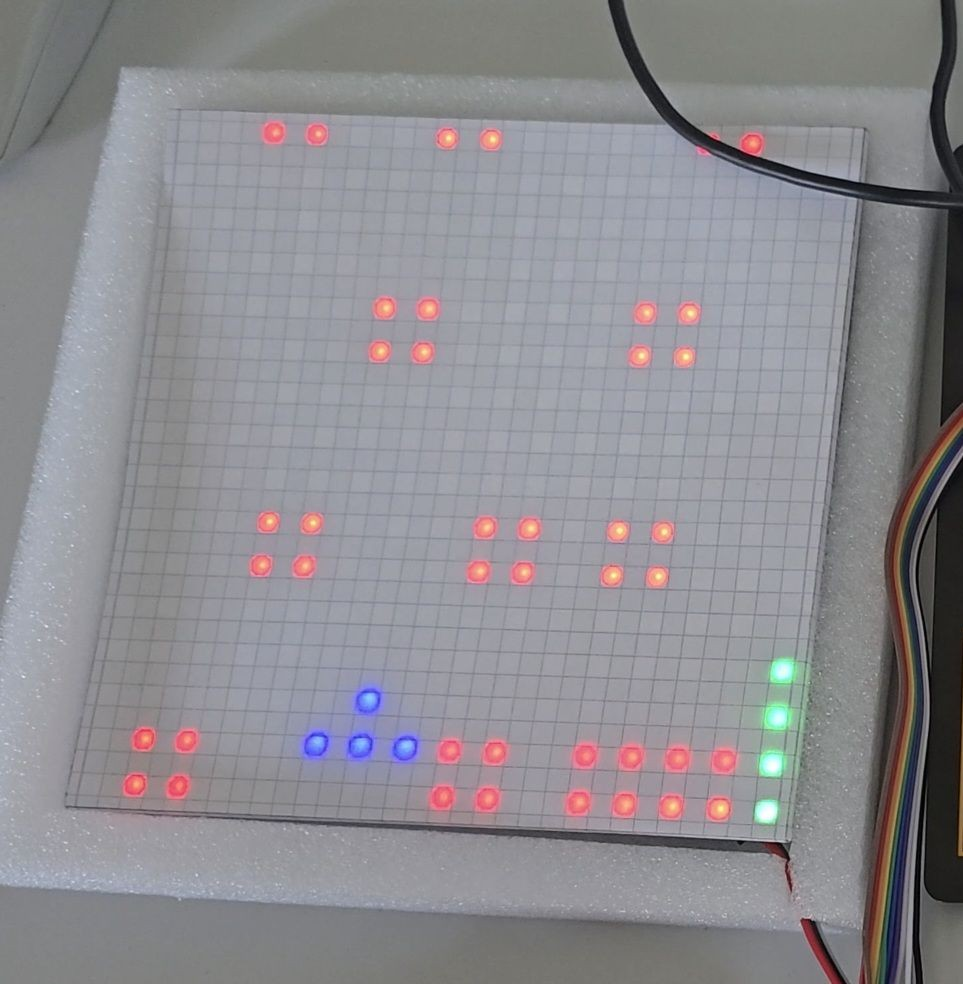
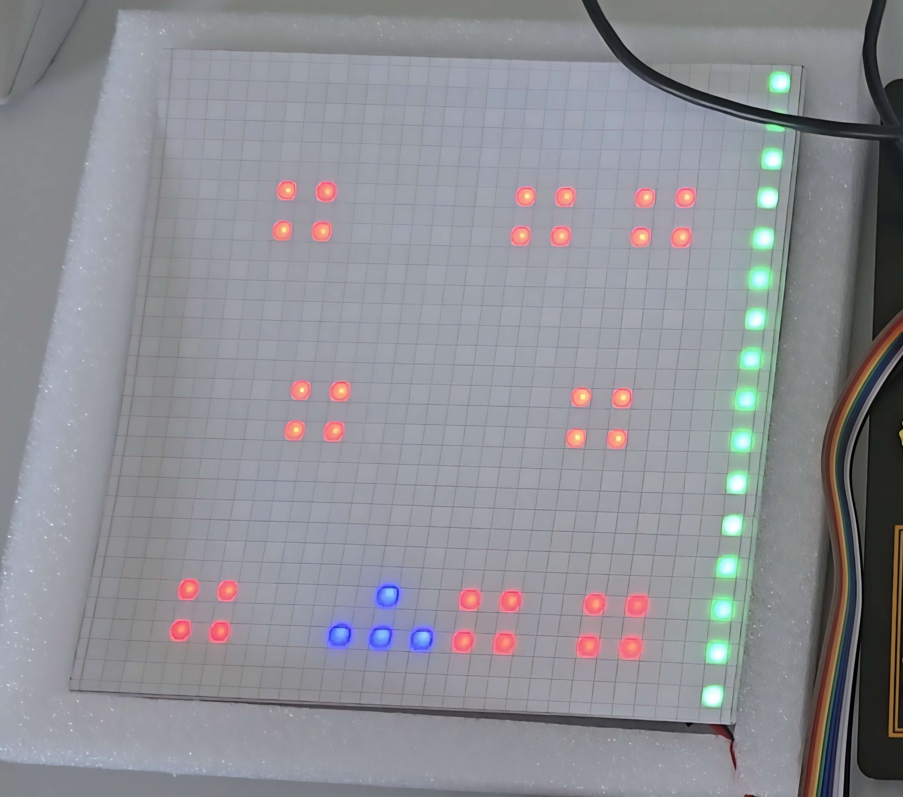
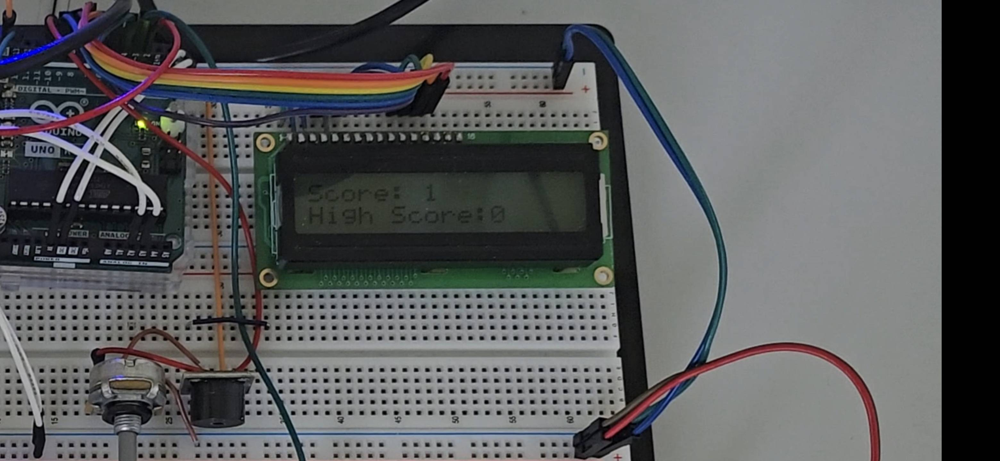

# Cubefield

Das Ziel von Cubefield ist es, den Würfeln, die auf den Spieler zukommen, auszuweichen und so eine mögichst weite Distanz zurückzulegen.

Während des Spiels wird die Geschwindigkeit, mit der der Sieler sich bewegt, immer weiter erhöht (bis sie ein Maximum erreicht). Wenn es ihm zu schnell wird kann er die Fähigkeit verwenden (sofern diese aufgeladen ist), mit der die Geschwindigkeit für eine kurze Zeit (4,8s) verringert wird.

## Funktionsweise
Das Timing sämtlicher Aktionen (wie die Framerate und der Fortschritt der Fähigkeits-progress-bar) wird über Timer-Interrupts gelöst, die alle 20ms ausgelöst werden und somit die "Spielticks" hochzählen. So wird beispielsweise, wenn ein Zähler einen bestimmten Wert erreicht, der zum erhöhen der Geschwindigkeit verändert werden kann, ein neues Bild berechnet und angezeigt. Die Positionen der Würfel sind in einem Array (Modul) gespeichert, das immer wieder von vorne durchlaufen wird, wodurch auch die Würfel immer wieder an den gleichen Positionen erscheinen. Um das zu beheben gibt es im [Demoprogramm](src/random_modules_demo.c) mehrere Module, die zufällig aneinandergereiht werden können und in der Konsole als Spielfeld ausgegeben werden. An Bibliotheken wurden FastLED, LiquidCrystal und EEPROM verwendet.

## Spielablauf
Am unteren Bildschirmrand wird der Spieler als Dreieck angezeigt und kann mit dem Joystick nach links oder rechts bewegt werden, sobald das Spiel gestartet wurde.

gesamter Aufbau vor dem Spielstart

Das Spiel wird gestartet indem auf den Joystick gedrückt wird. Wenn die Fähigkeits-progress-bar am rechten Bildschirmrand aufgealden ist kann der Joystick erneut gedrückt werden um das Spiel zu verlangsamen.

Auf dem LCD wird der aktuelle Score hochgezählt und darunter der Highscore angezeigt, der auf dem EEPROM gespeichert wird, damit er auch nach dem Abstecken des MC erhalten bleibt.

Scoreanzeige auf dem LCD

Wenn der Spieler in einen Würfel hineinfährt, ist das Spiel vorbei und der Highscore wird überschrieben, falls dieser überboten wurde.

Der unten auf der Steckplatine angebrachte Knopf kann zum Zurücksetzen des Highscore auf null genutzt werden.